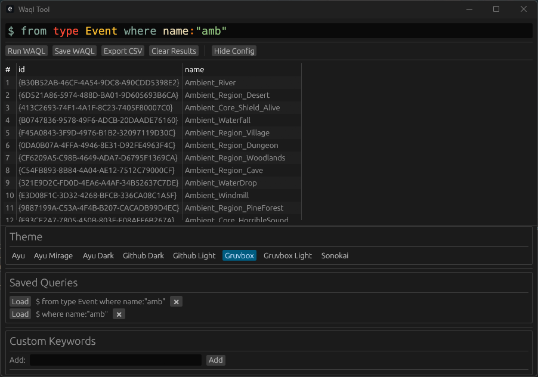

# WAQL Tool

> [English Version (README.en.md)](docs/README.en.md)


<div align="center">

一个功能强大的 Wwise WAQL (Wwise Authoring Query Language) 图形化查询工具

[](https://www.rust-lang.org/)
[](LICENSE)

</div>

## 📖 简介

WAQL Tool 是一个专为 Audiokinetic Wwise 设计的图形化查询工具，通过直观的界面帮助音频设计师和游戏开发者快速查询和管理 Wwise 项目中的对象。

## 📷 截图

<div align="center">
  
</div>

### ✨ 主要特性

- 🎨 **语法高亮** - 支持 WAQL 语法高亮显示，提升代码可读性
- 💡 **智能补全** - 内置 WAAPI 属性和访问器的代码自动补全
- 📊 **结果可视化** - 以表格形式展示查询结果，清晰易读
- 📁 **CSV 导出** - 一键导出查询结果为 CSV 文件
- 💾 **查询保存** - 保存常用查询语句，快速复用
- 🎯 **自定义关键词** - 添加项目特定的自定义关键词
- 🎨 **多主题支持** - 内置多种代码编辑器主题
- ⚙️ **配置持久化** - 自动保存用户配置和偏好设置

## 🚀 快速开始

### 前置要求

- Wwise 2021 或更高版本（需要启用 WAAPI）
- Windows 操作系统

### 安装

#### 方式一：下载预编译版本（推荐）

1. 访问 [Releases 页面](https://github.com/xmimu/waql-tool/releases)
2. 下载最新版本的 `waql-tool.exe`
3. 双击运行即可使用

#### 方式二：从源码编译

如果您需要修改代码或想要最新的开发版本：

1. **前置要求**
   - Rust 1.70 或更高版本

2. **克隆仓库**
```bash
git clone https://github.com/xmimu/waql-tool.git
cd waql-tool
```

3. **构建项目**
```bash
# 开发构建
cargo build

# 发布构建（推荐）
cargo build --release
```

4. **运行应用**
```bash
# 开发模式
cargo run

# 发布模式
cargo run --release
```

编译后的可执行文件位于 `target/release/waql-tool.exe`

### 配置 Wwise

确保 Wwise 的 WAAPI 功能已启用：

1. 打开 Wwise
2. 进入 `Project` -> `User Preferences` -> `WAAPI`
3. 勾选 `Enable WAAPI`
4. 重启 Wwise

## 📚 使用指南

### 基本用法

1. **编写查询**
   - 在代码编辑器中输入 WAQL 查询语句
   - 使用 `Ctrl+Space` 或输入时自动触发代码补全
   - 按 `Enter` 或点击"运行"按钮执行查询

2. **查看结果**
   - 查询结果会以表格形式显示在下方
   - 可以滚动查看所有列和行
   - 显示查询返回的对象数量

3. **导出数据**
   - 点击"导出 CSV"按钮
   - 选择保存位置和文件名
   - 结果将保存为 CSV 格式

### WAQL 查询示例

```waql
# 查找所有音效对象
$ from type Sound

# 查找特定名称的对象
$ from object "\\Actor-Mixer Hierarchy\\Default Work Unit\\MySound"

# 使用 where 子句过滤
$ from type Sound where name:"Footstep"

# 查找子对象
$ from type ActorMixer select children
```

### 支持同时指定 options 返回选项

```waql
# 选择特定属性 在 | 分割符之后
$ from type ActorMixer | name @Volume
```

### 配置面板

点击"设置"按钮打开配置面板，可以：

- 📝 **保存的查询** - 管理常用查询语句
  - 点击查询快速加载到编辑器
  - 删除不再需要的查询
  
- 🔤 **自定义关键词** - 添加项目特定关键词
  - 输入关键词并点击"添加"
  - 关键词会出现在代码补全中
  
- 🎨 **编辑器主题** - 选择代码编辑器配色方案
  - GRUVBOX（默认）
  - GITHUB DARK
  - AURA
  - 等多种主题
  
- 🔤 **字体大小** - 调整编辑器字体大小（8-24）

## 🏗️ 项目结构

```
waql-tool/
├── src/
│   ├── main.rs              # 应用程序入口
│   ├── lib.rs               # 库入口
│   ├── config.rs            # 配置管理
│   ├── query_executor.rs    # 查询执行器
│   ├── ui.rs                # UI 渲染
│   ├── fonts/               # 自定义字体
│   │   └── SIMKAI.TTF
│   └── waql/
│       ├── mod.rs           # WAQL 模块
│       ├── properties.rs    # WAAPI 属性定义
│       └── syntax.rs        # 语法高亮定义
├── py_helper/               # Python 辅助工具
│   ├── main.py
│   ├── pyproject.toml
│   └── README.md
├── Cargo.toml               # Rust 项目配置
├── REFACTORING.md           # 重构文档
└── README.md                # 本文件
```

### 模块说明

- **config** - 用户配置的序列化、反序列化和持久化
- **query_executor** - WAQL 查询的执行、结果解析和数据转换
- **ui** - 所有 UI 组件的渲染逻辑
- **waql** - WAQL 语法定义、WAAPI 属性和访问器列表

## 🔧 技术栈

- **[egui](https://github.com/emilk/egui)** - 即时模式 GUI 框架
- **[eframe](https://github.com/emilk/egui/tree/master/crates/eframe)** - egui 的原生窗口后端
- **[egui_code_editor](https://github.com/rylev/egui-code-editor)** - 代码编辑器组件
- **[waapi-rs](https://github.com/xmimu/waapi-rs)** - Wwise WAAPI Rust 客户端
- **[serde](https://serde.rs/)** - 序列化框架
- **[rfd](https://github.com/PolyMeilex/rfd)** - 原生文件对话框

## 📝 配置文件

用户配置保存在：
```
.\user_data.json
```

配置包含：
- 保存的查询列表
- 自定义关键词
- 编辑器主题
- 字体大小

## 🤝 贡献

欢迎提交 Issue 和 Pull Request！

### 开发流程

1. Fork 本仓库
2. 创建特性分支 (`git checkout -b feature/AmazingFeature`)
3. 提交更改 (`git commit -m 'Add some AmazingFeature'`)
4. 推送到分支 (`git push origin feature/AmazingFeature`)
5. 开启 Pull Request

### 代码规范

- 遵循 Rust 官方代码风格
- 使用 `cargo fmt` 格式化代码
- 使用 `cargo clippy` 检查代码质量
- 为公共 API 添加文档注释

## 📄 许可证

本项目采用 MIT 许可证。详见 [LICENSE](LICENSE) 文件。

## 🙏 致谢

- [Audiokinetic](https://www.audiokinetic.com/) - 提供强大的 Wwise 音频中间件
- [egui](https://github.com/emilk/egui) - 优秀的 Rust GUI 框架
- 所有贡献者和用户

## 📧 联系方式

- 项目主页: https://github.com/xmimu/waql-tool
- 问题反馈: https://github.com/xmimu/waql-tool/issues

---

<div align="center">
Made with ❤️ by <a href="https://github.com/xmimu">xmimu</a>
</div>
